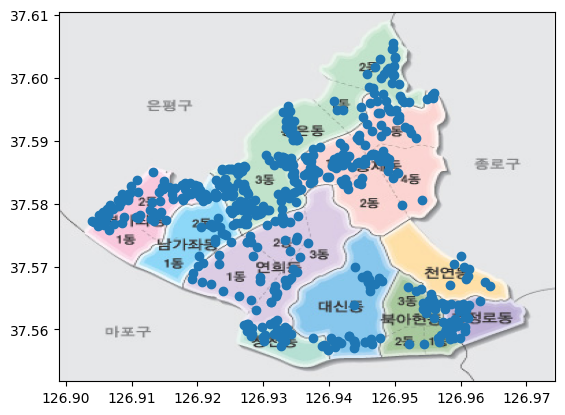

### 파이썬 프로그래밍

# Sets, Tuples, Dictionaries


---

### pandas란?

- **pandas**는 데이터 분석을 위해 사용되는 파이썬 라이브러리
- 효율적인 데이터 조작 및 분석을 위한 데이터 구조와 함수 제공.
- 주요 데이터 구조
  - **Series** : 1차원 데이터
  - **DataFrame** : 2차원 데이터

---

### Series

<div style="float:left; width: 50%; margin-right:30px">

```python

d1_data = [1, 2, 3, 4, 5]
series = pd.Series(d1_data)
print(series)


d2_data = {
    'name': ['철수', '영희', '민수'],
    'age': [25, 30, 35],
}
df = pd.DataFrame(d2_data)
print(df)

```

</div>

**Series**
일차원 배열과 유사한 자료구조.
인덱스로 각 요소에 접근

<br>

**DataFrame**
이차원 배열과 유사한 자료구조<br>
행과 열로 구성, 각 열은 서로 다른 자료형을 가질 수 있다.

---

**현재 우리 지역의 일주일 동안의 온도를 그래프로 나타내기**

**223.194.20.119:9973/1**

1. 데이터 다운로드
2. 전처리
3. 그래프화

---

### 사용한 메서드

```python
pd.read_csv('파일이름')
pd.pd.read_excel('파일이름')
...

변수.head() # 상위 5개 행 출력
변수.head(10) # 상위 10개 행 출력

변수.drop(columns=['라벨1','라벨2']) # 해당 라벨을 가진 열 삭제
변수.drop(rows=['라벨1','라벨2']) # 해당 라벨을 가진 행 삭제

변수.dropna() # NaN 삭제

변수.groupby('라벨') # 해당 라벨을 기준으로 그룹화

```

---

**의료수거함들의 위치 표시** (223.194.20.119:9973/2)

1. 데이터 전처리

   - pandas를 통해 위도와 경도를 뺀 모든 데이터 제거
   - `df.drop()` 이용

2. 위도와 경도 각각의 최댓값과 최솟값 찾기

   - 위도-경도 단위는 0.0x 이기에 일정 비율로 확대 필요
   - `df['라벨'].max()` 이용

3. 산점도로 나타내기

   - 경도와 위도를 각각 x, y로 scatter를 이용하여 표시

---

**의료수거함들의 위치 표시** (223.194.20.119:9973/2)

<div style="float:left; width: 40%; margin-right:30px">

```python
img = mpimg.imread('map.jpg')

extent = [df['경도'].min()-0.007,
          df['경도'].max()+0.01,
          df['위도'].min()-0.004,
          df['위도'].max()+0.005]
fig, ax = plt.subplots()
ax.imshow(img, extent=extent,
          aspect='auto')

```

</div>


