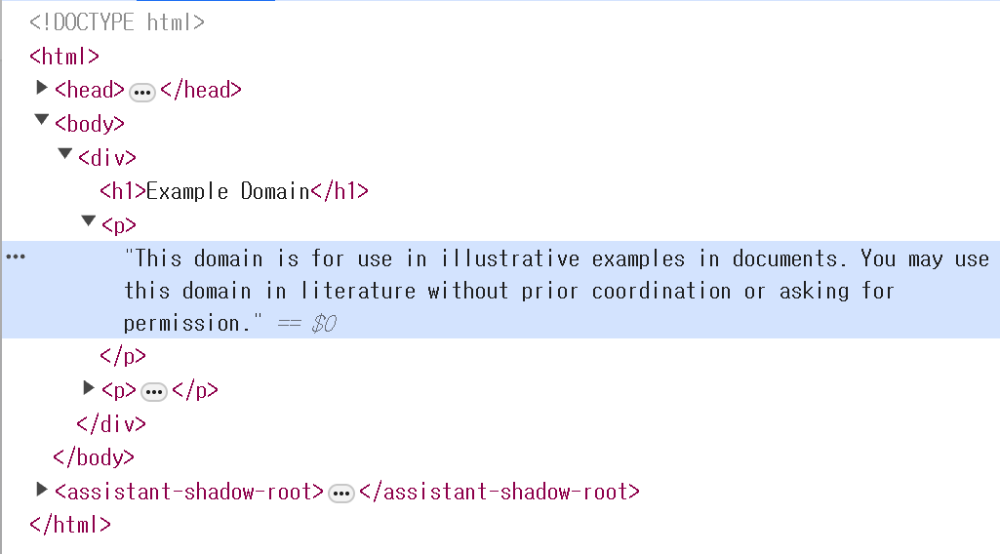
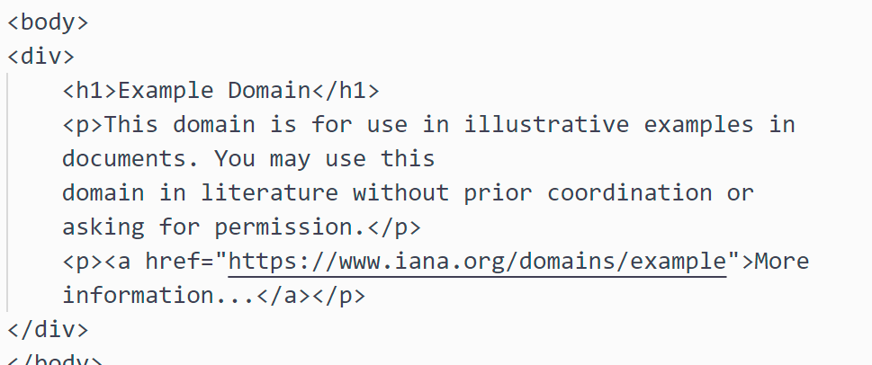
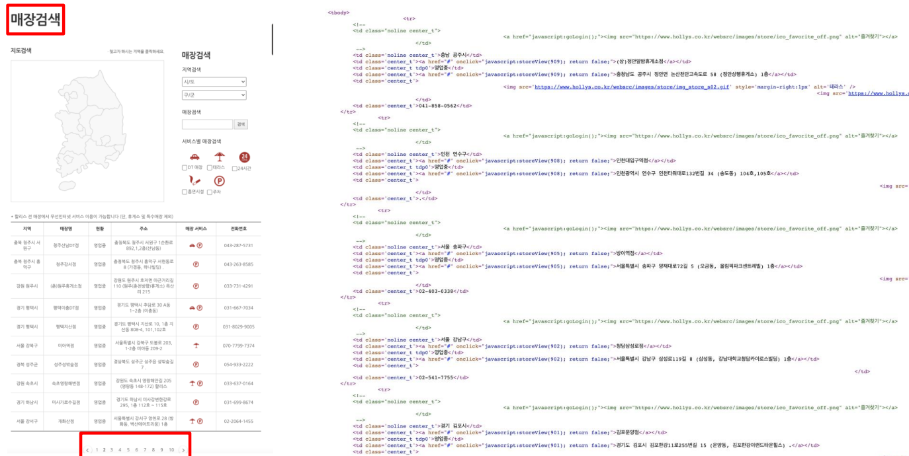

### 파이썬 프로그래밍

# 크롤링

---

### 크롤링이란?

- 크롤링: 웹 페이지를 그대로 가져와서 데이터를 추출해 내는 행위

- 크롤러: 크롤링을 하는 소프트웨어를 의미

---

### 크롤링

- Requests: 파이썬에서 웹사이트에 http 요청을 하기 위해 사용하는 모듈
- Beautifulsoup4: html을 쉽게 사용할 수 있도록 파싱해줄 수 있는 모듈

- 설치 `pip install bs4 requests`

---

### Requests

- requests 함수를 이용해 html을 가져오기
- 가져오기를 성공한 경우: "<Response [200]>"을 반환

- 실습: 아래 링크의 html을 가져오기
- https://www.google.com

```python

    import requests
    url = "https://www.google.com"
    response = requests.get(url)
    print(response)

```

---

### Requests

- .text를 붙여주면 가져온 html을 텍스트 형식으로 보여줌

```python

    print(response.text)

```

---

### html 페이지

- `ctrl` + `shift` + `i`를 누르면 개발자도구 창을 볼 수 있음.
- `ctrl` + `u`를 누르면 html 코드를 볼 수 있음.

---

### 웹페이지와 html 비교하기




- requests로 가져온 html과 동일

---

### BeautifulSoup

- BeautifulSoup을 사용하면 html의 태그를 파싱해서 필요한 데이터만 추출
- resp.text는 request를 사용해 받아온 소스를 파이썬 내장 parser인 html.parser을 사용해 html소스를 파이썬 객체로 변환하는 과정

```python
  from bs4 import BeautifulSoup

  url = "https://weather.naver.com/"
  resp = requests.get(url)

  soup = BeautifulSoup(resp.text,'html.parser')
  print(soup.find('title'))

```

---

### BeautifulSoup

- find(): 가장 먼저 검색되는 태그만 반환하는 함수
- find_all(): 검색되는 태그 전체를 반환하는 함수

```python

  print(soup.find_all('p'))

```

1. p라는 태그를 가진 모든 문장을 반환: <p></p>

2. 리스트 형식으로 저장

---

### BeautifulSoup

- id, class로도 검색 가능

```python

  data = soup.find_all(id = "hourly")
  print(data)

```

- class의 경우 파이썬에서 기본으로 사용하는 키워드이기 때문에 뒤에 \_를 붙여줘야한다

```python

  data = soup.find_all(class_ = "section_wrap section_center weather_area")
  print(data)

```

---

### BeautifulSoup

- 정규표현식을 활용가능
- 원하는 단어가 들어있는 문장
- '날씨'라는 단어가 한 번이상 나온 것을 list로 모두 찾음

```python

  data = soup.find_all(string = re.compile('날씨+'))
  print(data)

```

---

### 예제

- 할리스커피 매장 정보 찾기

- 할리스커피 홈페이지(https://www.hollys.co.kr)

- HTML코드 확인: Ctrl + U

---



---

### 할리스 커피 매장 정보

- 나머지 매장 정보 확인
- https://www.hollys.co.kr/store/korea/korStore2.do?pageNo=2&sido=&gugun=&store=

---

### 크롤링 소스코드

```python
from bs4 import BeautifulSoup
import urllib.request
import pandas as pd
import datetime

def hollys_store(result):
  for page in range(1,57):
    Hollys_url = 'https://www.hollys.co.kr/store/korea/korStore2.do?pageNo=%d&sido=&gugun=&store=' %page
    print (Hollys_url)
    html = urllib.request.urlopen (Hollys_url)
    soupHollys = BeautifulSoup(html, 'html.parser')
    tag_tbody = soupHollys.find('tbody')
    for store in tag_tbody.find_all('tr'):
      if len(store) <= 3:
        break
      store_td = store.find_all('td')
      store_name = store_td[1].string
      store_sido = store_td[0].string
      store_address = store_td[3].string
      store_phone = store_td[5].string
      result.append([store_name]+[store_sido]+[store_address] +[store_phone])
  return re

def main():
  result = []
  print('Hollys store crawling >>>>')
  hollys_store(result)
  hollys_tbl = pd.DataFrame (result, columns=('store', 'sido-gu', 'address', 'phone'))
  hollys_tbl.to_csv('hollys.csv', encoding='cp949', mode='w', index=True)
  del result[:]

if_name == '__main__':
  main() # main 함수를 실행시키는 코드
```

---

### 크롤링 데이터 저장 확인


